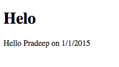

# react-intro

## Intro - Learning React with a minimal (tool) chains

This is a series of examples for a basic intro to React.js using plain old javascript and no toolchain.
This is achieved by simply including lib/react-with-addons.js and lib/JSXTransformer.js.

I believe that it is better to develop using your own IDE and using chrome development tools instead of jsfiddle or jsbin - which are harder to debug.

This repo has examples of increasing difficulty that don't require any build tools. 
Next step is to see the (future todo) react-webpack-redux for examples using full toolchain.

## 01 hello example Notes

1. a. The container where React output is rendered
   b. The lib are core libraries that are in head, 
   c. But the jsx for ReactJS components are put at end of body
   d. The document.getElementById('container') has to occur after the element parsed in DOM i.e. body

	<!DOCTYPE html>
	<html lang="en">
	<head>
		<meta charset="UTF-8">
		<title>Hello1</title>
		
		
	</head>
	<body>
		<h1>Helo</h1>
		

		
	</body>
	</html>

2. hello1.jsx introduces basic component for an App page

	var App = React.createClass({
	  getInitialState: : function() {
	    return {
	      date:'1/1/2015'
	    },
	  render: function() {
	    return (
	      

	        Hello {this.props.name} on {this.state.date}
	      

	    );
	  }
	});
	React.render(<App name="Pradeep" />, document.getElementById('container'));

3. Web Components - attribute passed parameters
	The core building block of React.js is to use attribute passed parameters as in following
		<App name="Pradeep" />

4. PROPS. The attribute parameters, in turn are accessed by this.props.name. 

5. STATE. You can access the state for a component. 
	{this.state.date}

6. render property of a component 
The core is to 

7. JSX-isms - here we have glossed over the JSX which allows DOM tree creation using XML with embedded javascript and styling (also as JS objects). More on this in next example.

	- JSX only handles one component at a time - so if you return multiple, wrap them in a div:
		
 <Component1 /> <Component2 /> 

	- Any javascript expressions have to be escaped in braces {this.props.name}

* Debugging/Tools Tip - Look in browser console for errors. This is harder due to heavy weight of JSFiddle/JSBin, etc.

	Uncaught Error: Parse Error: Line 2: Unexpected token :
	    at http://localhost:8080/aPKJ-react-intro/01_hello/hello1.jsx:2:undefined
	getInitialState: : function() {

* Future-wise note
	- ReactDOM.render is used in more recent libraries.

	- The container can support SPA by mapping views there - look at react-router for that.

## 01 hello example Notes

## 03 List of Cards Notes using mock json and jquery

