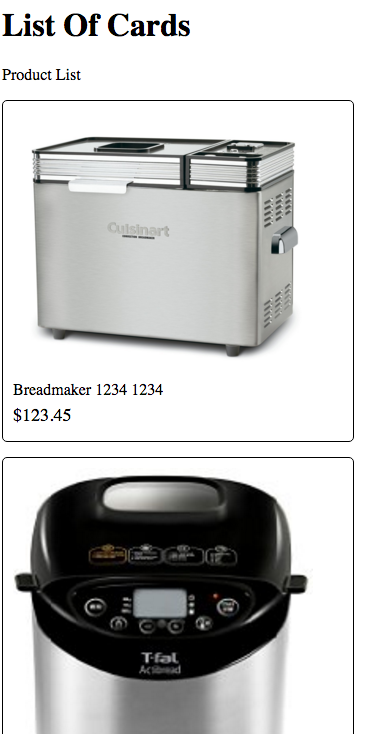

# react-intro

## Intro - Learning React with a minimal (tool) chains

This is a series of examples for a basic intro to React.js using plain old javascript and no toolchain.
This is achieved by simply including lib/react-with-addons.js and lib/JSXTransformer.js.

I believe that it is better to develop using your own IDE and using chrome development tools instead of jsfiddle or jsbin - which are harder to debug.

This repo has examples of increasing difficulty that don't require any build tools. 
Next step is to see the (future todo) react-webpack-redux for examples using full toolchain.

## 01 hello example Notes

* Basic Hello World example - shows the following 

	

1. a. The container where React output is rendered
   b. The lib are core libraries that are in head, 
   c. But the jsx for ReactJS components are put at end of body
   d. The document.getElementById('container') has to occur after the element parsed in DOM i.e. body
	
	```html
	<!DOCTYPE html>
	<html lang="en">
	<head>
		<meta charset="UTF-8">
		<title>Hello1</title>
		<script src="../lib/JSXTransformer.js"></script>
		<script src="../lib/react-with-addons.js"></script>
	</head>
	<body>
		<h1>Helo</h1>
		<div id="container"></div>
		<script src="hello1.jsx"  type="text/jsx"></script>
	</body>
	</html>
	```


2. hello1.jsx introduces basic component for an App page

	```javascript
	var App = React.createClass({
	  getInitialState: : function() {
	    return {
	      date:'1/1/2015'
	    },
	  render: function() {
	    return (
	      <div>
	        Hello {this.props.name} on {this.state.date}
	      </div>
	    );
	  }
	});
	React.render(<App name="Pradeep" />, document.getElementById('container'));
	```

3. Web Components - attribute passed parameters
	The core building block of React.js is to use attribute passed parameters as in following
		<App name="Pradeep" />


4. PROPS. The attribute parameters, in turn are accessed by this.props.name. 

5. STATE. You can access the state for a component. 
	{this.state.date}


6. render property of a component 
The core is to 

7. JSX-isms - here we have glossed over the JSX which allows DOM tree creation using XML with embedded javascript and styling (also as JS objects). More on this in next example.

	- JSX only handles one component at a time - so if you return multiple, wrap them in a div:
		<div> <Component1 /> <Component2 /> </div>

	- Any javascript expressions have to be escaped in braces {this.props.name}

* Debugging/Tools Tip - Look in browser console for errors. This is harder due to heavy weight of JSFiddle/JSBin, etc.

	Uncaught Error: Parse Error: Line 2: Unexpected token :
	    at http://localhost:8080/aPKJ-react-intro/01_hello/hello1.jsx:2:undefined
	getInitialState: : function() {


* Future-wise note
	- ReactDOM.render is used in more recent libraries.

	- The container can support SPA by mapping views there - look at react-router for that.


## 02 List of Cards with Styling

* We want to display a list of Products 
	


1. The HTML wrapper is the same - all the logic is in Javascript. This is one of the beauties of React.js - you can compose the application mostly architecturally in Javascript and Web components.

		. . . in the HTML
	<div id="container"></div>

		. . . in the JSX render the App into the container
	React.render(<App />, document.getElementById('container'));


2. Raw data - for now we hardwire the data for products ..

	```javascript
	var ps = [
		{productId:1234,name:"Breadmaker 1234",price:"$123.45",image:"images/breadmaker1.jpg"},
		{productId:1236,name:"Breadmaker 1235",price:"$423.45",image:"images/breadmaker2.jpg"},
		{productId:1236,name:"Breadmaker 1236",price:"$623.45",image:"images/breadmaker3.jpg"}
	];
	```


3. The Product web component 
	- This is a simple HTML template ith styles attached. 
	- The attributes are passed as this.props.*
	- Usage <Product productId:p.productId, name:p.name, price:p.price, image:p.image></Product>

	```javascript
	var Product = React.createClass({
	  render: function() {
	    return (
	      <div style= {styProductBox} >
	        
	        <p style={styProductTitle} >{this.props.name} {this.props.productId}</p>
	        <p style={styProductPrice} >{this.props.price}</p>
	      </div>
	    );
	  }
	});
	```


4. The Top level component needs to iterate over the Raw product data to create a list.
	- Note the standard JS array.map() function is used which requires for each product p a return of JSX
	- TIP: within the JSX attributes the only thing that works is name={p.name}, note name="{p.name}" or name="p.name"
	- Note the JS string pl is really JSX which is returned from the concatanation from the this.state.ps.map()
	       This is something a bit weird and you need to get used to.
	- Later on the render() function simply uses this as a JS expression {ps}

	```javascript
	var App = React.createClass({
	  displayName: 'App',
	  getInitialState: function() {
	    return {
	      ps:ps
	      //product:{productId:1234,name:"Breadmaker 1234",price:"$123.45",image:""}
	    }
	  },
	  render: function() {
		var pl = this.state.ps.map(function(p) {
			// console.log(p);
	    	 return(<Product productId={ps[0].productId} name={p.name} price={p.price} image={p.image} >
	    	 	    </Product>);
		});
	    return (
	      <div>
	      	<p>Product List</p>
	      	{pl}
	      </div>
	    );
	  }
	});
	```


5. Now lets style the items .. A few JSX things
	- The styles are "like CSS" but need to be each a JS object.
	- The style names with - e.g. border-radius will become camel case i.e. borderRadius.
	- The properties all have to be in quotes e.g. '5px'
	- In each use of the style refer it as ..

	```javascript
	<div style= {styProductBox} >

	var styProductBox = {
		border: '1px solid black',
	  // height: '200px',
	  width: '330px',
	  margin: '0px 0px 15px 0px',
	  padding: '10px',
	  borderRadius: '5px'
	}
	```


## 03 List of Cards using mock json and jquery


